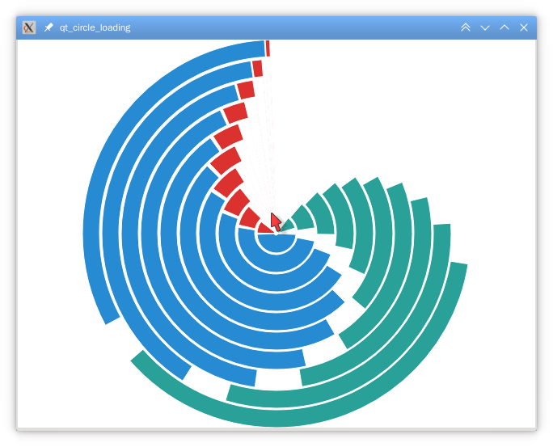

# qt_circle_loading

A loading animation widget for Qt

A very example to use it:

    #include <QtWidgets/qapplication.h>
    #include "circle_loading_widget.h"

    int main(int argc, char** argv)
    {
        QApplication app(argc, argv);
        CircleLoadingWidget w;
        w.show();
        w.start();
        return app.exec();
    }

## API

### void setColors(const QList<QColor> &colors);

Set at least 3 foreground colors to use.

### void setBackground(const QBrush &background);

Set background brush. Can be a simple color, or complex patterns.

### void start();

Start the animation.

### void stop();

Stop the animation.

## License

LGPL with static link exception.

You don't have to open source your program at all times. But you should open source the modification to qt_circle_loading.
